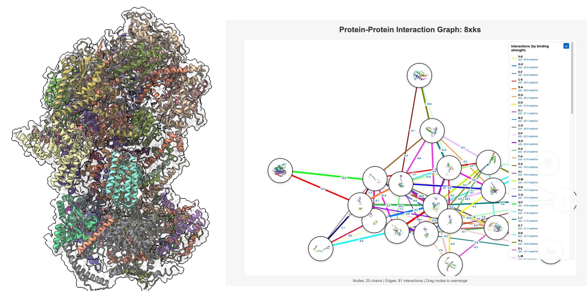
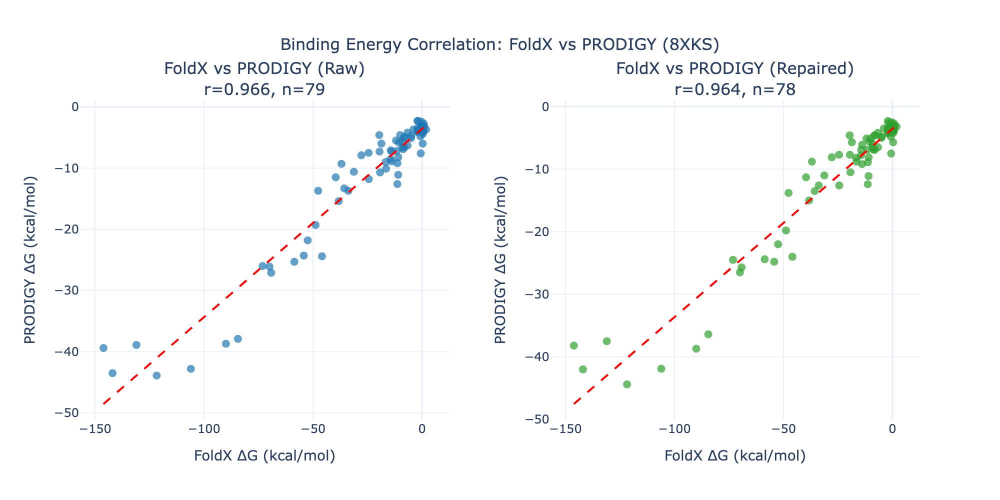

# Struct2PPI - Protein-Protein Interaction Network Visualizer from protein complexes

Generate interactive protein-protein interaction graphs from PDB/CIF files of Cryo-EM complexes.



## Features

- Parse PDB and mmCIF structure files
- Extract chain labels from COMPND (PDB) or entity information (CIF)
- Detect protein-protein interactions using distance-based cutoff (default 5.0 Å)
- Filter non-protein molecules (ligands, ions, lipids) automatically
- Generate interactive HTML visualizations with:
  - Draggable nodes
  - Colored edges with legend
  - Hover information (chain names, contact counts)
- Export chain descriptions and interacting residue pairs to text files

## Scripts

### `ppi_graph.py` - Standard 2D Network Graph
Interactive Plotly-based visualization with draggable nodes and colored edges.

```bash
python ppi_graph.py structure.cif
python ppi_graph.py structure.pdb --cutoff 5.0
```

### `ppi_graph_3d.py` - STRING DB Style with 3D Structures
Network graph with 3D protein structures rendered inside nodes using 3Dmol.js.

```bash
python ppi_graph_3d.py structure.cif
python ppi_graph_3d.py structure.pdb --cutoff 4.0
```

### `ppi_graph_3d_dg.py` - 3D Structures with Binding Energy (PRODIGY)
Network graph with 3D protein structures and binding energy (ΔG) calculated using PRODIGY for each interacting chain pair. **PDB files only.**

Features:
- Calculates binding affinity (ΔG in kcal/mol) for each chain pair using PRODIGY
- Displays ΔG values as edge labels on the graph
- Legend sorted by binding strength (strongest interactions first)
- Creates separate PDB files for each interacting chain pair
- Outputs binding strength ranking file

```bash
python ppi_graph_3d_dg.py structure.pdb
python ppi_graph_3d_dg.py structure.pdb --cutoff 4.0
python ppi_graph_3d_dg.py structure.pdb --skip-prodigy  # Skip PRODIGY (for testing)
```

## Output Files

For input `structure.pdb` (or `.cif` for ppi_graph.py/ppi_graph_3d.py):
- `structure_ppi_graph.html` - Interactive 2D network (ppi_graph.py)
- `structure_ppi_3d.html` - Network with 3D structure nodes (ppi_graph_3d.py)
- `structure_ppi_3d_dg.html` - Network with 3D nodes + binding energy (ppi_graph_3d_dg.py)
- `structure_chain_info.txt` - Chain ID to protein name mapping
- `structure_residue_contacts.txt` - All interacting residue pairs (with ΔG for ppi_graph_3d_dg.py)
- `structure_binding_strength.txt` - Chain pairs sorted by binding strength (ppi_graph_3d_dg.py)
- `structure_complexes/` - PDB files for each chain pair (ppi_graph_3d_dg.py)

## Dependencies

```bash
pip install biopython networkx plotly scipy numpy prodigy-prot
```

| Package | Purpose |
|---------|---------|
| biopython | PDB/CIF parsing, structure manipulation |
| networkx | Graph building and layout algorithms |
| plotly | Interactive 2D visualization |
| scipy | Distance calculations (cdist) |
| numpy | Numerical operations |
| prodigy-prot | Binding energy calculation (ppi_graph_3d_dg.py) |

For 3D visualization (`ppi_graph_3d.py`, `ppi_graph_3d_dg.py`), 3Dmol.js is loaded from CDN (no installation required).

## Usage Examples

```bash
# Basic usage with CIF file
python ppi_graph.py 8xks.cif

# Custom distance cutoff
python ppi_graph.py structure.pdb --cutoff 4.0

# 3D structure nodes (STRING DB style)
python ppi_graph_3d.py 8xks.cif

# 3D structure nodes with binding energy (PDB only)
python ppi_graph_3d_dg.py 8xks.pdb

# Specify output directory
python ppi_graph.py structure.cif --output-dir ./results
python ppi_graph_3d_dg.py structure.pdb --output-dir ./results
```

## Test Data

The `test/` folder contains example outputs generated from PDB entry 8XKS (20 protein chains, 81 interactions).

## ΔG Evaluation


The PRODIGY-based binding energy prediction is intended for **rapid assessment** of protein-protein interaction strengths directly from experimental structures. While PRODIGY provides reliable relative rankings (r=0.96 correlation with FoldX on 8XKS complex), for accurate absolute binding free energy values, consider using more rigorous methods like FoldX, Rosetta or MM/GBSA. Also even little preprocessing of PDB input (repairing missing atoms, relaxation, energy minimization) can improve the quality of binding energy predictions but not always. 
For example evaluation was performed using FoldX 5.1 on a repaired structure PDB ID 8XKS. As you can see repairing structure using RepairPDB from FoldX didn't improve correlation with FoldX dG values. But PRODIGY itself gives good correlation with FoldX dG values.


> Delgado J., Reche R., Cianferoni D., Orlando G., van der Kant R., Rousseau F., Schymkowitz J., Serrano L. "FoldX force field revisited, an improved version." *Bioinformatics*, Volume 41, Issue 2, btaf064 (2025). DOI: [10.1093/bioinformatics/btaf064](https://doi.org/10.1093/bioinformatics/btaf064)

## References

If you use the binding energy prediction feature (`ppi_graph_3d_dg.py`), please cite PRODIGY:

> Xue L., Rodrigues J., Kastritis P., Bonvin A.M.J.J., Vangone A. "PRODIGY: a web server for predicting the binding affinity of protein-protein complexes." *Bioinformatics* (2016). DOI: [10.1093/bioinformatics/btw514](https://doi.org/10.1093/bioinformatics/btw514)

> Vangone A. and Bonvin A.M.J.J. "Contacts-based prediction of binding affinity in protein-protein complexes." *eLife*, 4:e07454 (2015). DOI: [10.7554/eLife.07454](https://doi.org/10.7554/eLife.07454)

> Kastritis P.L., Rodrigues J.P.G.L.M., Folkers G.E., Boelens R., Bonvin A.M.J.J. "Proteins Feel More Than They See: Fine-Tuning of Binding Affinity by Properties of the Non-Interacting Surface." *Journal of Molecular Biology*, 14, 2632–2652 (2014). DOI: [10.1016/j.jmb.2014.04.017](https://doi.org/10.1016/j.jmb.2014.04.017)
