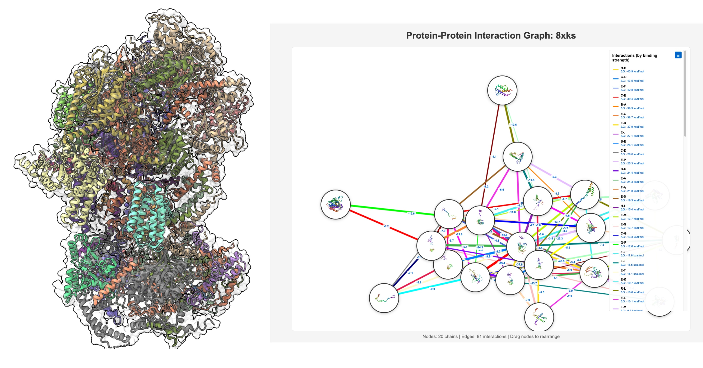
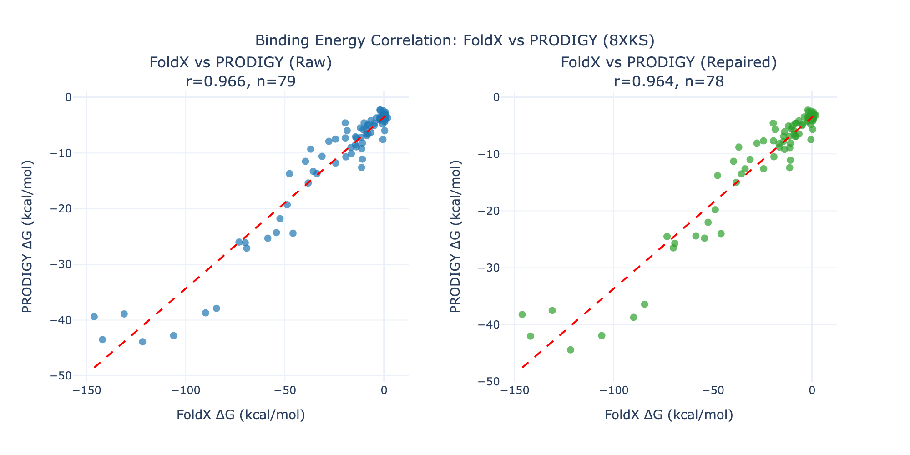

# Struct2PPI - Protein-Protein Interaction Network Visualizer from protein complexes

Generate interactive protein-protein interaction graphs from PDB/CIF files of Cryo-EM complexes (and not just Cryo-EM).



## Features

- Parse PDB and mmCIF structure files
- Extract chain labels from COMPND (PDB) or entity information (CIF)
- Detect protein-protein interactions using distance-based cutoff (default 5.0 Å)
- Filter non-protein molecules (ligands, ions, lipids) automatically
- Generate interactive HTML visualizations with:
  - Draggable nodes
  - Colored edges with legend
  - Hover information (chain names, contact counts)
- Export chain descriptions and interacting residue pairs to text files

## Scripts

### `ppi_graph.py` - Standard 2D Network Graph
Interactive Plotly-based visualization with draggable nodes and colored edges.

```bash
python ppi_graph.py structure.cif
python ppi_graph.py structure.pdb --cutoff 5.0
```

### `ppi_graph_3d.py` - STRING DB Style with 3D Structures
Network graph with 3D protein structures rendered inside nodes using 3Dmol.js.

```bash
python ppi_graph_3d.py structure.cif
python ppi_graph_3d.py structure.pdb --cutoff 4.0
```

### `ppi_graph_3d_dg.py` - 3D Structures with Binding Energy (PRODIGY + FoldX)
Network graph with 3D protein structures and binding energy (ΔG) calculated using PRODIGY for each interacting chain pair. Supports FoldX integration for force-field-based scoring and mutation analysis. **PDB files only.**

Features:
- Calculates binding affinity (ΔG in kcal/mol) for each chain pair using PRODIGY
- Displays ΔG values as edge labels on the graph
- Legend sorted by binding strength (strongest interactions first)
- Creates separate PDB files for each interacting chain pair
- Outputs binding strength ranking file
- FoldX RepairPDB + AnalyseComplex scoring (`--fx_score`)
- FoldX BuildModel mutation ΔΔG analysis (`--fx_mut`)
- One-vs-all PRODIGY mode: each chain vs all others combined (`--one_vs_all`)

```bash
# PRODIGY binding energy
python ppi_graph_3d_dg.py structure.pdb
python ppi_graph_3d_dg.py structure.pdb --cutoff 4.0
python ppi_graph_3d_dg.py structure.pdb --skip-prodigy  # Skip PRODIGY (for testing)

# FoldX scoring (RepairPDB + AnalyseComplex)
python ppi_graph_3d_dg.py structure.pdb --fx_score --fx_path /path/to/foldx

# FoldX mutation ddG (BuildModel, skips repair)
python ppi_graph_3d_dg.py structure.pdb --fx_mut individual_list.txt --fx_path /path/to/foldx

# One-vs-all: each chain vs all others combined (PRODIGY)
python ppi_graph_3d_dg.py structure.pdb --one_vs_all
```

#### Flags

| Flag | Description |
|------|-------------|
| `--fx_score` | Run FoldX RepairPDB on the input structure, then AnalyseComplex to score interaction energies for each chain pair |
| `--fx_path` | Path to the FoldX executable (required with `--fx_score` or `--fx_mut`) |
| `--fx_mut` | Path to `individual_list.txt` with mutations for FoldX BuildModel. Skips repair (copies input with `_Repair.pdb` suffix), runs BuildModel, then AnalyseComplex on both WT and mutant structures to calculate binding ΔΔG per chain pair |
| `--one_vs_all` | For each chain, combine all other chains as a single partner and calculate binding energy via PRODIGY (`--selection A B,C,D,...`) |

## Output Files

For input `structure.pdb` (or `.cif` for ppi_graph.py/ppi_graph_3d.py):
- `structure_ppi_graph.html` - Interactive 2D network (ppi_graph.py)
- `structure_ppi_3d.html` - Network with 3D structure nodes (ppi_graph_3d.py)
- `structure_ppi_3d_dg.html` - Network with 3D nodes + binding energy (ppi_graph_3d_dg.py)
- `structure_chain_info.txt` - Chain ID to protein name mapping
- `structure_residue_contacts.txt` - All interacting residue pairs (with ΔG for ppi_graph_3d_dg.py)
- `structure_binding_strength.txt` - Chain pairs sorted by binding strength (ppi_graph_3d_dg.py)
- `structure_complexes/` - PDB files for each chain pair (ppi_graph_3d_dg.py)
- `structure_foldx_scores.txt` - FoldX interaction energy ranking (`--fx_score`)
- `structure_foldx_ddg.txt` - FoldX binding ΔΔG per chain pair (`--fx_mut`)
- `structure_one_vs_all.txt` - One-vs-all PRODIGY ranking (`--one_vs_all`)
- `structure_foldx/` - FoldX working directory with intermediate files (`--fx_score` or `--fx_mut`)

## Dependencies

```bash
pip install biopython networkx plotly scipy numpy prodigy-prot
```

| Package | Purpose |
|---------|---------|
| biopython | PDB/CIF parsing, structure manipulation |
| networkx | Graph building and layout algorithms |
| plotly | Interactive 2D visualization |
| scipy | Distance calculations (cdist) |
| numpy | Numerical operations |
| prodigy-prot | Binding energy calculation (ppi_graph_3d_dg.py) |

For FoldX features (`--fx_score`, `--fx_mut`), [FoldX](https://foldxsuite.crg.eu/) must be installed separately (academic license required).

For 3D visualization (`ppi_graph_3d.py`, `ppi_graph_3d_dg.py`), 3Dmol.js is loaded from CDN (no installation required).

## Usage Examples

```bash
# Basic usage with CIF file
python ppi_graph.py 8xks.cif

# Custom distance cutoff
python ppi_graph.py structure.pdb --cutoff 4.0

# 3D structure nodes (STRING DB style)
python ppi_graph_3d.py 8xks.cif

# 3D structure nodes with binding energy (PDB only)
python ppi_graph_3d_dg.py 8xks.pdb

# Specify output directory
python ppi_graph.py structure.cif --output-dir ./results
python ppi_graph_3d_dg.py structure.pdb --output-dir ./results

# FoldX: repair structure and score all chain pair interactions
python ppi_graph_3d_dg.py 8xks.pdb --fx_score --fx_path /path/to/foldx

# FoldX: calculate mutation effect on binding between chains
python ppi_graph_3d_dg.py 5L08.pdb --fx_mut individual_list.txt --fx_path /path/to/foldx --skip-prodigy

# One-vs-all: rank chains by total binding contribution
python ppi_graph_3d_dg.py 8xks.pdb --one_vs_all --skip-prodigy
```

## Test Data

The `test/` folder contains example outputs generated from PDB entry 8XKS (20 protein chains, 81 interactions).

## ΔG Evaluation
### Binding Energy Prediction
PRODIGY-based binding energy prediction enables rapid assessment of protein-protein interaction strengths directly from experimental structures. While PRODIGY excels at providing reliable relative rankings between complexes, users seeking accurate absolute binding free energy values should consider more rigorous methods such as FoldX, Rosetta, or MM/GBSA.
### Validation
Benchmarking on PDB ID 8XKS demonstrated strong correlation between PRODIGY and FoldX 5.1 ΔG values (r = 0.966). Notably, structure preprocessing with FoldX RepairPDB (repairing missing atoms, energy minimization) did not substantially improve this correlation (r = 0.964), suggesting that PRODIGY performs robustly even on unprocessed experimental structures


> Delgado J., Reche R., Cianferoni D., Orlando G., van der Kant R., Rousseau F., Schymkowitz J., Serrano L. "FoldX force field revisited, an improved version." *Bioinformatics*, Volume 41, Issue 2, btaf064 (2025). DOI: [10.1093/bioinformatics/btaf064](https://doi.org/10.1093/bioinformatics/btaf064)

## References

If you use the binding energy prediction feature (`ppi_graph_3d_dg.py`), please cite PRODIGY:

> Xue L., Rodrigues J., Kastritis P., Bonvin A.M.J.J., Vangone A. "PRODIGY: a web server for predicting the binding affinity of protein-protein complexes." *Bioinformatics* (2016). DOI: [10.1093/bioinformatics/btw514](https://doi.org/10.1093/bioinformatics/btw514)

> Vangone A. and Bonvin A.M.J.J. "Contacts-based prediction of binding affinity in protein-protein complexes." *eLife*, 4:e07454 (2015). DOI: [10.7554/eLife.07454](https://doi.org/10.7554/eLife.07454)

> Kastritis P.L., Rodrigues J.P.G.L.M., Folkers G.E., Boelens R., Bonvin A.M.J.J. "Proteins Feel More Than They See: Fine-Tuning of Binding Affinity by Properties of the Non-Interacting Surface." *Journal of Molecular Biology*, 14, 2632–2652 (2014). DOI: [10.1016/j.jmb.2014.04.017](https://doi.org/10.1016/j.jmb.2014.04.017)
